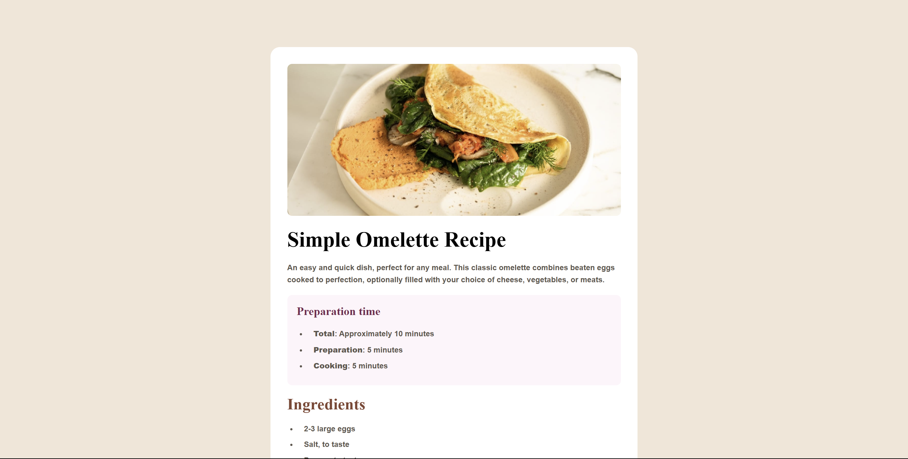

# Frontend Mentor - Recipe page solution

This is a solution to the [Recipe page challenge on Frontend Mentor](https://www.frontendmentor.io/challenges/recipe-page-KiTsR8QQKm). Frontend Mentor challenges help you improve your coding skills by building realistic projects. 

## Table of contents

- [Overview](#overview)
  - [The challenge](#the-challenge)
  - [Screenshot](#screenshot)
  - [Links](#links)
- [My process](#my-process)
  - [Built with](#built-with)
  - [What I learned](#what-i-learned)
- [Author](#author)

## Overview

### Screenshot



### Links

- Solution URL: [Add solution URL here](https://your-solution-url.com)
- Live Site URL: [https://yetithesleepingchancellor.github.io/recipe-page/](https://yetithesleepingchancellor.github.io/recipe-page/)

## My process

### Built with

- Semantic HTML5 markup
- CSS custom properties
- Flex-box
- Mobile-first workflow
- Responsive design

### What I learned
```html
<h1 id="page-title">Simple Omelette Recipe</h1>
```


```css
  hr {
      border: none;
      height: 1px;
      background-color: var(--Stone-150);
  }
```
```css
  table {
      width: 100%;
      padding: 20px;
      margin-top: 15px;
      border-collapse: collapse;
  }
```

## Author

- Website - [Sandip Tamang](https://www.tamangsandip.com.np)
- Frontend Mentor - [@YetiTheSleepingChancellor](https://www.frontendmentor.io/profile/YetiTheSleepingChancellor)
- Linkedin - [Sandip Tamang](https://www.linkedin.com/in/sandiptamang/)
